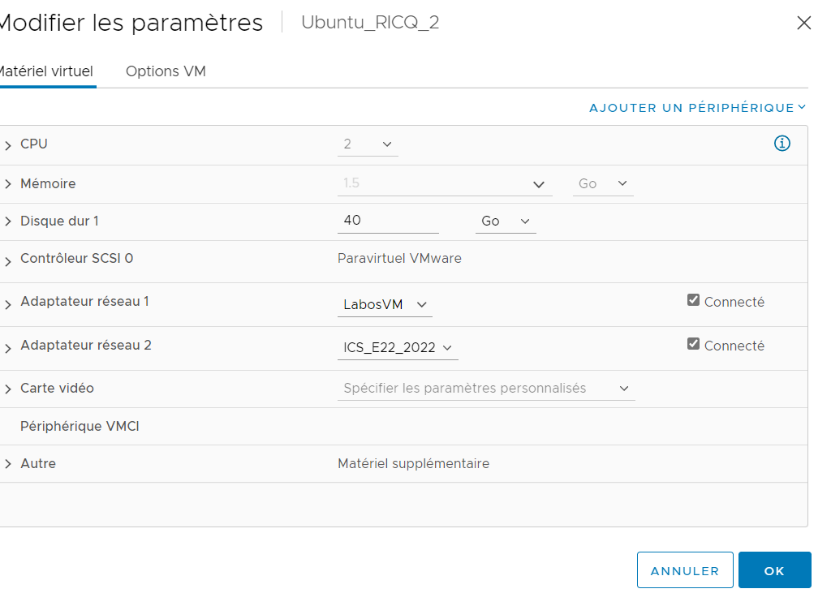
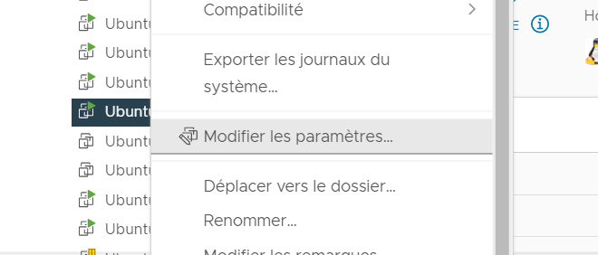

[TP6 :]{.ul}

# Table des matières {#table-des-matières .TOC-Heading}

[Exercice 1 : Adressage IP (rappels) :
1](#exercice-1-adressage-ip-rappels)

[Exercice 2. Préparation de l'environnement :
3](#exercice-2.-préparation-de-lenvironnement)

[Exercice 3. Installation du serveur DHCP :
5](#exercice-3.-installation-du-serveur-dhcp)

[Exercice 4. Donner un accès à Internet au client :
8](#exercice-4.-donner-un-accès-à-internet-au-client)

[Exercice 5. Installation du serveur DNS :
9](#exercice-5.-installation-du-serveur-dns)

[Exercice 6. Configuration du serveur DNS pour la zone tpadmin.local :
10](#exercice-6.-configuration-du-serveur-dns-pour-la-zone-tpadmin.local)

# Exercice 1 : Adressage IP (rappels) :

[Question 1 :]{.ul} Répartition VLSM de 172.16.0.0 /23 :

[SR1 :]{.ul}

52 IP

Bits nécessaires : 6 (car 2\^6 = 64)

Masque : 32 -- bits nécessaires = 32- 6 = 26 /26

Sous-Réseau =\>

\@réseau : 172.16.0.0 /26

Plage restante : 172.16.0.64 /26

[SR2 :]{.ul}

38 IP

Bits nécessaires : 6 (car 2\^6 = 64)

Masque : 32 -- bits nécessaires = 32- 6 = 26 /26

Sous-Réseau =\>

\@réseau : 172.16.0.64 /26

Plage restante : 172.16.0.128 /26

[SR3 :]{.ul}

37 IP

Bits nécessaires : 6 (car 2\^6 = 64)

Masque : 32 -- bits nécessaires = 32- 6 = 26 /26

Sous-Réseau =\>

\@réseau : 172.16.0.128 /26

Plage restante : 172.16.0.192 /26

[SR4 :]{.ul}

35 IP

Bits nécessaires : 6 (car 2\^6 = 64)

Masque : 32 -- bits nécessaires = 32- 6 = 26 /26

Sous-Réseau =\>

\@réseau : 172.16.0.192 /26

Plage restante : 172.16.1.0 /26

[SR5 :]{.ul}

34 IP

Bits nécessaires : 6 (car 2\^6 = 64)

Masque : 32 -- bits nécessaires = 32- 6 = 26 /26

Sous-Réseau =\>

\@réseau : 172.16.1.0 /26

Plage restante : 172.16.1.64 /26

[SR6 :]{.ul}

33 IP

Bits nécessaires : 6 (car 2\^6 = 64)

Masque : 32 -- bits nécessaires = 32- 6 = 26 /26

Sous-Réseau =\>

\@réseau : 172.16.1.64 /26

Plage restante : 172.16.1.128 /26

[SR7 :]{.ul}

25 IP

Bits nécessaires : 5 (car 2\^5 = 32)

Masque : 32 -- bits nécessaires = 32- 5 = 27 /27

Sous-Réseau =\>

\@réseau : 172.16.1.128 /27

Plage restante : 172.16.1.160 /27

# Exercice 2. Préparation de l'environnement :

{width="6.268055555555556in"
height="3.2527777777777778in"}

{width="3.7777777777777777in"
height="2.7555555555555555in"}{width="2.9166666666666665in"
height="1.2455413385826772in"}[Question 1 :]{.ul}

[Question 2 :]{.ul} (ssh <User@172.18.165.114>) Une fois le serveur
démarré, on utilise la commande **ip a** :

{width="6.268055555555556in"
height="2.442361111111111in"}

La nouvelle interface est la ens224, pour l'instant elle est DOWN (=
arrêté).

Lo fait référence à loopback.

[Question 3 :]{.ul} {width="6.268055555555556in"
height="4.186111111111111in"}

[Question 4 :]{.ul}

-   Pour le serveur dhcp : {width="6.268055555555556in"
    height="2.1645833333333333in"}

-   Pour le client : {width="6.268055555555556in"
    height="2.327777777777778in"}

# Exercice 3. Installation du serveur DHCP :

[Question 1 :]{.ul} On utilise la commande suivante **apt install
isc-dhcp-server**

{width="6.268055555555556in"
height="3.3694444444444445in"}

Les 2 premières lignes correspondent :

-   C' est la durée en minutes ou en secondes pendant laquelle un
    périphérique réseau peut utiliser une adresse IP dans un réseau.
    L'adresse IP est réservée à cet appareil jusqu'à l'expiration de la
    réservation.

-   C' est la durée maximale de location.

-   

Voici le résultat une fois que le client est lié au serveur dhcp :

{width="6.268055555555556in"
height="0.9180555555555555in"}

Avec la commande **tail -f /var/log/syslog** , nous allons vérifier les
requêtes DHCP en cours:

{width="6.268055555555556in"
height="1.9597222222222221in"}

Voici un schéma résumant le trafique DHCP :

{width="3.3958333333333335in"
height="3.951898512685914in"}

/var/lib/dhcp/dhcpd.leases C'est une base de données persistante des
baux qu'il a attribués. Cette base de données est un fichier ASCII de
forme libre contenant une série de déclarations de bail. Chaque fois
qu'un bail est acquis, renouvelé ou libéré, sa nouvelle valeur est
enregistrée à la fin du dossier de location. Ainsi, si plus d'une
déclaration apparaît pour un bail donné, la dernière dans le fichier est
la déclaration actuelle.

La commande **dhcp-lease-list** permet de lister qui utilise (avec une
\@MAC) le serveur DHCP et avec quelle \@IP :

{width="6.268055555555556in"
height="1.1493055555555556in"}

On a donc notre serveur = 192.168.100.1 et le client = 192.168.100.100

On effectue la commande ping pour tester la connectivité :

{width="6.268055555555556in"
height="1.7673611111111112in"}

Nous allons entrer la configuration suivante dans le fichier
/etc/dhcp/dhcpd.conf pour que le client récupère l'adresse IP
192.168.100.20 :

**deny unknown-clients; \#empêche l\'attribution d\'une adresse IP à
une**

**\#station dont l\'adresse MAC est inconnue du serveur**

**host client {**

**hardware ethernet 00:50:56:89:61:1F; \#remplacer par l\'adresse MAC**

**fixed-address 192.168.100.20;**

**}**

Pour que le changement soit pris rapidement en compte, il faut
désactiver et réactiver l\'interface réseau :

{width="6.268055555555556in"
height="0.8597222222222223in"}

Mais on peut aussi utiliser la commande **dhclient -v** :

{width="6.268055555555556in"
height="2.0236111111111112in"}

# Exercice 4. Donner un accès à Internet au client :

Nous allons activer l'IP Forwarding en modifiant le fichier
/etc/sysctl.conf, puis pour vérifier que cela a bien été effectué nous
allons utiliser la commande **sysctl net.ipv4.ip_forward**.

ATTENTION juste après avoir modifier /etc/sysctl.conf il faut bien
entrer la commande suivante pour que les changements effectués
précédemment soient bien pris en compte.

{width="6.268055555555556in"
height="0.8479166666666667in"}

Nous allons activer le nat avec la commande suivante :

**sudo iptables \--table nat \--append POSTROUTING \--out-interface
ens192 -j MASQUERADE**

Attention dans la commande précédente, l'interface à indiquer est celle
sur le serveur qui permet l'accès à internet.

# Exercice 5. Installation du serveur DNS :

Nous allons tout d'abord installer bind9 avec la commande : **apt
install bind9 -y**

Pour configurer BIND9 nous allons décommenter la partie forwarder dans
le fichier /etc/bin/named.conf.options :

{width="4.877029746281715in"
height="3.6294050743657045in"}

Nous pouvons vérifier que le service fonctionne :

{width="6.268055555555556in"
height="1.9215277777777777in"}

Pour le tester que notre configuration fonctionne, nous allons effectuer
un ping vers google.fr :

{width="6.268055555555556in"
height="2.420138888888889in"}

Le client a bien accès à internet grâce au serveur DHCP.

# 

# Exercice 6. Configuration du serveur DNS pour la zone tpadmin.local :

Nous allons tout d'abord modifier le fichier /etc/bin/named.conf.local
pour y ajouter les lignes suivantes :

**zone \"tpadmin.local\" IN {**

**type master; // c\'est un serveur maître**

**file \"/etc/bind/db.tpadmin.local\"; // lien vers le fichier de
définition de zone**

**};**

Nous allons par la suite faire une cpie du fichier db.local pour la
nommer db.tpadmin.local :

{width="5.93832895888014in"
height="3.9901399825021873in"}

Dans ce fichier nous faisons correspondre un nom d'une machine à une
adresse IP. Il s'agit de la zone de recherche directe.

Nous allons ensuite ajouter les lignes suivantes dans le fichier
/etc/bin/named.conf.local :

**zone \"100.168.192.in-addr.arpa\" {**

**type master;**

**file \"/etc/bind/db.192.168.100\";**

**};**

Nous allons par la suite faire une cpie du fichier db.127 pour la nommer
db.192.168.100 :

{width="6.268055555555556in"
height="3.4756944444444446in"}

Dans ce fichier nous faisons correspondre une adresse IP à un nom d'une
machine. Il s'agit de la zone de recherche inverse.

Pour vérifier que les configurations DNS ne posent pas de problèmes,
nous allons utiliser des utilitaires permettant la vérifications :

-   \$ named-checkconf named.conf.local

-   \$ named-checkzone tpadmin.local /etc/bind/db.tpadmin.local

-   \$ named-checkzone 100.168.192.in-addr.arpa /etc/bind/db.192.168.100

{width="6.268055555555556in"
height="1.0798611111111112in"}

[Remarque :]{.ul} à 75% du temps du bail dhcp, le client recontacte le
srv et si marche pas alors il le refait à 82.5%.

Pour faire une dernière vérification nous allons faire un ping du client
vers le serveur en se servant de son nom :

{width="6.268055555555556in"
height="0.8291666666666667in"}

Puis du serveur vers le client (toujours avec le nom) :

{width="6.268055555555556in"
height="0.8555555555555555in"}
